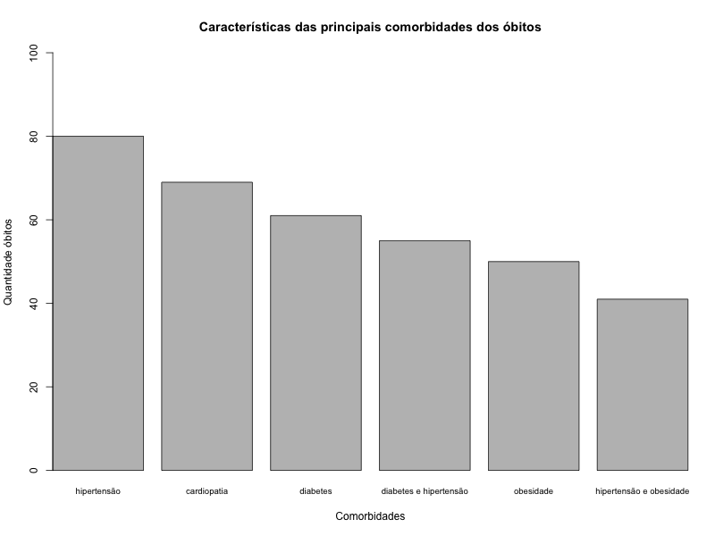

<style>
body {
text-align: justify}
</style>

```{r setup, include=FALSE}
knitr::opts_chunk$set(echo = TRUE)
```

# Introdução

Este documento refere-se ao trabalho final da disciplina de Introdução à Análise Exploratória de Dados, ministrada pelo professor João Pedro Albino, no ano de 2021/2022, pela Faculdade de Ciências - UNESP Câmpus de Bauru.
O projeto consiste em realizar uma Análise Exploratória de Dados em relação a pandemia causada pelo Coronavírus (COVID-19) e como está impactando a vida das pessoas na cidade de Bauru.
As análises realizadas mostram a distribuição de mortes de acordo com a idade dos pacientes, gênero, quais as características das comorbidades dos óbitos, a variação periódica de tais óbitos, tipos e tempo de permanência hospitalar dos pacientes e a relação entre óbitos ocorridos e a vacinação dos falecidos.


# Análise Exploratória dos Dados

## Óbitos entre gêneros

Foi realizada uma análise para verificar qual a taxa de óbitos entre os gêneros. O gráfico a seguir mostra o que foi obtido.

```{r echo=FALSE}
library(readxl)

df.mortes <- read_excel("../dados/covid_19_bauru_mortes.xlsx", col_types = c("date", "text", "numeric", "date","text","text", "date", "numeric"))

temp.sexo <- df.mortes$sexo[!is.na(df.mortes$sexo)]
pct.sexo = round(unname(table(temp.sexo)) / sum(unname(table(temp.sexo)))*100,0)
pct.sexo = paste0(pct.sexo, "%")

graph.sex <- barplot(table(temp.sexo), main = "Óbitos por gênero",
        ylab = "Número de Óbitos", ylim = c(0,sum(unname(table(temp.sexo)))),
        names.arg = c("Feminino", "Masculino"))
text(x = graph.sex, y = table(temp.sexo), label = pct.sexo, pos = 3, cex = 1.25, col = "red")
axis(1, at=graph.sex, labels=table(temp.sexo), tick=F, las=1, line=-6.5, cex.axis=1.25)
```

Pode-se verificar que a maior parte dos óbitos são do gênero masculino, com 57%, seguido do gênero feminino, com 43%.

## Distribuição dos óbitos de acordo com a idade dos pacientes

Foi realizado uma análise para verificar qual a distribuição dos óbitos de acordo com a idade dos pacientes.


Pode-se constatar no histograma que a maior frequência de mortes está concentrada entre as idades de 50 a 90 anos, seguida pela idade de 40 a 50. Isso mostra que o coronavírus tem mais impacto em pessoas com idades mais avançadas.

## Características das principais comorbidades dos óbitos

Foi realizado uma análise para verificar quais as características das principais comorbidades dos óbitos.
A tabela e o gráfico a seguir mostram quais as comorbidades que mais sofreram óbitos.

```{r echo=FALSE}
library(readxl)

planilha <- read_excel("../dados/covid_19_bauru_mortes.xlsx")
Comorbidades <- planilha$'comorbidade'

dataFrame <- data.frame(table(Comorbidades))
Qtde <- dataFrame$Freq

sortedDataFrame <- dataFrame[order(-Qtde),]
firstSixRows <- head(sortedDataFrame)
firstSixRows
```



Pode-se constatar que hipertensão é a comorbidade mais atingida pelo coronavírus, com um total de 80 óbitos. É possível verificar também que a hipertensão, em conjunto com outra comorbidade, também está entre as 6 comorbidades mais atingidas. Ocorreram 55 óbitos de pessoas que possuíam diabetes e hipertensão e 41 óbitos de pessoas que possuíam hipertensão e obesidade.


## Variação periódica dos óbitos

Foi realizado uma análise para verificar a variação periódica dos óbitos. O gráfico mostra o que foi obtido.

```{r echo=FALSE}
library(readxl)
df.mortes <- read_excel("../dados/covid_19_bauru_mortes.xlsx", 
                        col_types = c("date", "text", "numeric", "date","text","text", "date", "numeric"))

plot(df.mortes$data_obito, main = "Variação Periódica de óbitos", 
     xlab = "Óbitos ocorridos", ylab = "Período/datas")
```

É possível perceber que os óbitos não ficaram estáveis em nenhum momento, a linha está em uma constante crescente, porém menos que no período antes de 2021. Isso mostra que a vacinação é sim eficaz, mas ainda é necessário uma atenção por parte da população, para cada um fazer sua parte, utilizar máscara e evitar aglomerações.

## Tipos e tempo de permanência hospitalar

### Tipo de permanência hospitalar

Foi realizado uma análise para verificar a quantidade de cada tipo de hospitalização. A tabela a seguir mostra os dados obtidos.

```{r echo=FALSE}
library(readxl)
df.mortes <- read_excel("../dados/covid_19_bauru_mortes.xlsx", 
                        col_types = c("date", "text", "numeric", "date","text","text", "date", "numeric"))

temp.hosp <- df.mortes$tipo_hosp[!is.na(df.mortes$tipo_hosp)]
pct.hosp = round(unname(table(temp.hosp)) / sum(unname(table(temp.hosp)))*100,0)
pct.hosp = paste0(pct.hosp, "%")
graph.hosp <- barplot(table(temp.hosp), main = "Óbitos por tipo de hospitalização", ylab = "Número de Óbitos", ylim = c(0,sum(unname(table(temp.hosp)))), names.arg = c("Privado", "Público")) 
text(x = graph.hosp, y = table(temp.hosp), label = pct.hosp, pos = 3, cex = 1.25, col = "red")
axis(1, at=graph.hosp, labels=table(temp.hosp), tick=F, las=1, line=-4.5, cex.axis=1.25)
```

Percebe-se que a maioria das hospitalizações foram em hospitais públicos, o que explica o rápido esgotamento de leitos nas unidades públicas de saúde.

### Tempo de permanência hospitalar

O próximo gráfico mostra o tempo de permanência hospitalar até o óbito.

```{r echo=FALSE}
library(ggplot2)
library(readxl)
dados <- read_excel("../dados/covid_19_bauru_mortes.xlsx")
tempo <- difftime(as.Date(dados$'data_obito'), as.Date(dados$'inicio_sintoma'), units = "days")

ggplot(as.data.frame(table(tempo)), aes(x = tempo, y = Freq),) + scale_x_discrete(guide = guide_axis(check.overlap = TRUE)) + labs(x = "Dias de internação", y = "Óbitos", fill = "Dias") + ggtitle("Tempo de permanência hospitalar") + theme(legend.position = "none") + geom_bar(stat="identity", position="stack") + geom_col(width=0.8)
```

É possível perceber que a maior parte dos pacientes que vieram a óbito ficaram internados aproximadamente entre 3 e 36 dias.

## Relação entre óbitos ocorridos e a vacinação dos falecidos

Foi realizado uma análise para verificar a relação entre os óbitos e a vacinação dos falecidos. A tabela a seguir mostra os dados obtidos.

```{r echo=FALSE}
# A planilha original foi alterada substituindo os espaços em branco por 0 na coluna 'doses_vacina'.
# Dessa forma a tabela fica da seguinte forma apresentada.

library(readxl)
options(max.print=1200)

planilha <- read_excel("../dados/covid_19_bauru_mortes.xlsx")
Doses <- planilha$'doses_vacina'

as.data.frame(table(Doses))
```

Pode-se constatar que a maior frequência de óbitos foram das pessoas que ainda não haviam tomado nenhuma dose da vacina, com um total de 1020 pessoas. A segunda maior frequência é de pessoas que tomaram 2 doses, com um total de 66. Pessoas que tomaram apenas uma dose da vacina têm um total de 5. Uma observação para isso é que, entre essas pessoas, pode conter aquelas que tomaram a dose única, ou seja, estavam totalmente imunizadas.

# Conclusão

Com este trabalho foi possível analisar alguns dados referentes aos óbitos por conta da COVID-19 na cidade de Bauru. Pode-se concluir que o vírus afetou muita gente, não somente bauruenses. É necessário continuar seguindo os protocolos de segurança, principalmente as pessoas que possuem algum tipo de comorbidade. Também é necessário se vacinar, pois como mostram as análises, o maior índice de óbitos são daqueles que não se vacinaram.